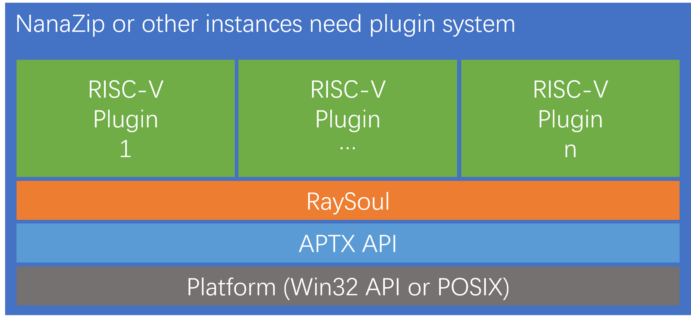
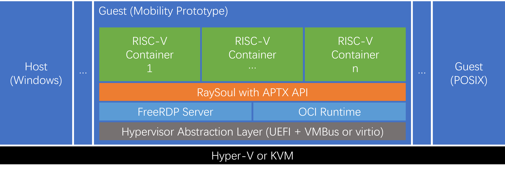

# RaySoul

A fast, lightweight, portable and secure runtime based on 64-bit RISC-V
Unprivileged ISA Specification.

## Planned Scenarios

- Softwares need plugin system

- Unikernel for paravirtualization guests

